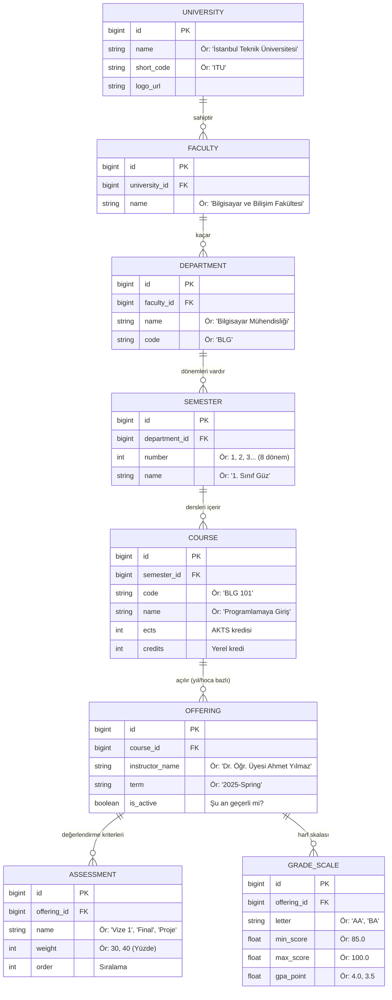

# 🗄️ Veritabanı Şeması (Database Schema)

Bu belge, **Faz 2** kapsamında MySQL veritabanında oluşturulacak tabloları ve aralarındaki ilişkileri açıklar.

> **Önemli Not:** Her üniversitenin (hatta fakültenin) kendine has bir yapısı olduğu için, **Bölümler (Departments)** tablosu global değildir; doğrudan o üniversitenin fakültesine bağlıdır. Böylece İTÜ Bilgisayar ile YTÜ Bilgisayar tamamen ayrı varlıklar olarak yönetilir.

---

## 📊 ER Diyagramı (UML)

---

## 📝 Tablo Açıklamaları (Nerede Ne Var?)

### 1. Hiyerarşi Katmanı (Statik Veri)
Bu katman, üniversitenin akademik yapısını tanımlar ve nadiren değişir.

*   **UNIVERSITY (Üniversite):** En tepedeki varlık.
    *   *Örnek:* `ID: 1, Name: 'İstanbul Teknik Üniversitesi', Code: 'ITU'`
*   **FACULTY (Fakülte):** Üniversiteye bağlı akademik birimler.
    *   *Örnek:* `ID: 10, UniID: 1, Name: 'Bilgisayar ve Bilişim Fakültesi'`
*   **DEPARTMENT (Bölüm):** Öğrencinin okuduğu bölüm. **Burada İTÜ Bilgisayar ile YTÜ Bilgisayar ayrı ID'lere sahiptir.**
    *   *Örnek:* `ID: 100, FacID: 10, Name: 'Bilgisayar Mühendisliği'`

### 2. Müfredat Katmanı (Ders Programı)
Bölümün ders programını tanımlar.

*   **SEMESTER (Dönem):** Bölümün totaldeki 8 yarıyılını (veya hazırlık dahil) tutar.
    *   *Örnek:* `ID: 1001, DeptID: 100, Name: '1. Sınıf Güz'`
*   **COURSE (Ders):** Katalogdaki dersin kendisidir (Hocadan bağımsız).
    *   *Örnek:* `ID: 500, SemID: 1001, Code: 'BLG 101', Name: 'Giriş'`

### 3. Değerlendirme Katmanı (Dinamik/Değişken)
**En kritik kısım burasıdır.** Bir dersin her dönem, her hoca tarafından farklı işlenebileceği gerçeğini yönetir.

*   **OFFERING (Açılan Ders / Şube):** Bir dersin o dönem, o hoca tarafından verilen hali.
    *   *Örnek:* `ID: 9999, CourseID: 500, Instructor: 'Dr. Furkan', Term: '2025-Spring'`
*   **ASSESSMENT (Değerlendirme Kriteri):** Vize, Final yüzdeleri burada tutulur. Hocaya/Döneme özgüdür.
    *   *Örnek:* `OfferingID: 9999, Name: 'Vize', Weight: 40`
*   **GRADE_SCALE (Harf Skalası):** Harf notlarının aralıkları burada tutulur. Çan eğrisi veya katalog sistemi olabilir.
    *   *Örnek:* `OfferingID: 9999, Letter: 'AA', Min: 85, Max: 100`

---

## ❓ Sık Sorulan Sorular

**Soru: İTÜ Bilgisayar ile YTÜ Bilgisayar aynı tabloda mı?**
**Cevap:** Evet, ikisi de `DEPARTMENT` tablosunda durur ama `FACULTY_ID` (dolayısıyla `UNIVERSITY_ID`) farklı olduğu için tamamen ayrı yönetilirler. İsimleri aynı olsa bile farklı derslere (COURSE) sahip olabilirler.

**Soru: Bir hocanın kriterleri değişirse ne olur?**
**Cevap:** Eski `OFFERING` kaydı (Ör: 2024) değişmez. Yeni dönem için yeni bir `OFFERING` (Ör: 2025) açılır ve yeni kriterler (`ASSESSMENT`) oraya bağlanır. Böylece geçmiş dönem hesaplamaları bozulmaz.
